# Nvidia Jetson Orin Nano

# 升級 SUPER mode

## 致謝

本手冊之完成與相關研究設備之建置，特別感謝蘇建華董事長慷慨支持，提供本系資訊數學組使用 NVIDIA Jetson Orin Nano 開發板，協助本系推動人工智慧、邊緣運算與數學應用相關之教學與研究工作。

董事長對於高等教育與科技人才培育之重視，不僅提升本系學生之實作能力，也為跨領域學習與研究奠定良好基礎。在此謹致以最誠摯之感謝與敬意。

## 目錄

- [頁首](#nvidia-jetson-orin-nano)
- [致謝](#致謝)
- [第一章-系統主機安裝準備](#linux-系統主機安裝準備)
- [第二章-安裝 linux 系統](#安裝-linux-系統)
- [第三章-升級 Jetson Orin Nano](#升級-jetson-orin-nano)
- [第四章-使用 ssh 並傳輸資料](#使用-ssh-並傳輸資料)
- [第五章-安裝並使用 jtop](#安裝並使用-jtop)
- [第六章-安裝並測試 Webcam](#安裝並測試-webcam)
- [第七章-使用 OpenCV 處理影像](#使用-opencv-處理影像)

## Linux 系統主機安裝準備

如果沒有 Linux 主機，可以選擇 Windows + Linux 雙系統，先預留切割硬碟空間 80〜120GB 給 Linux 系統 ，再使用 Usb 隨身碟進行安裝，或是硬碟在初期就已經切割過可以使用已經切好的空間。

在切割硬碟空間前確認以下條件

- 足夠的硬碟空間(至少預留 40〜60GB 給 Linux 系統)
- BIOS 模式為 UEFI
- 支援安全開機 (Secure Boot)
- 關閉 BitLocker
- 關閉 快速啟動
- 不要壓縮系統磁碟

切割硬碟空間

下載 MiniTool Partition Wizard（免費版即可）

- https://www.partitionwizard.com/free-partition-manager.html

開啟 MiniTool Partition Wizard


打開後找到 D 槽


右鍵點 D 槽 → Move/Resize (移動/調整)


把 D 槽的「右側邊界」往左拖 180GB 的距離


按 Ok 讓系統執行磁碟移動

- 進入一個藍色背景的介面，執行磁碟移動（可能 5〜30 分鐘）

等待系統要求重新啟動

完成後你會看到剛剛選擇的槽位被分割了

## 安裝 Linux 系統

接下來製作 Ubuntu 開機 USB

我們會需要

- 至少 8GB 的 USB 隨身碟、網路

準備好隨身碟，點開下面的網址

- https://releases.ubuntu.com/22.04


選擇 ubuntu-22.04.5-desktop-amd64.iso 進行下載


下載後在存放的地方可以找到剛剛所下載的 ubuntu-22.04.5-desktop-amd64.iso (應該是 CD icon )


然後我們要下載 Rufus (製作 USB 工具的程式)

- https://rufus.ie/zh_TW


在網頁下面找到下載的區域


找到適合自己系統的版本並且下載 (示範版本為 Windows x86)


打開下載好的程式


裡面的畫面應該如下圖


插入剛剛所準備的 USB ，會看到裝置的欄位會偵測到所插入的 USB

會看到 (裝置) 的地方顯示 USB 的名稱


找到 (開機模式) 那一行右手邊的選擇按鈕

找到剛剛你所下載的 iso 檔案並且打開

打開成功會看到剛剛下載的 Ubuntu 版本跟藍色勾勾


接下來確認資料分割是 GPT


目標系統會自動選擇 UEFI


檢查檔案系統是否為 Large FAT32


確定 Rufus 程式內的裝置內容和下圖一致就可以按下 (執行) 讓程式製作 USB 開機工具

接著會跳出下圖的畫面

選擇以 ISO 映像模式寫入


按下 OK 後程式會提醒你


再次按下 OK 後程式就會開始運作

等到程式運作完成

保持 USB 插著接著重新啟動電腦

當 Windows 正在重啟時，開始按 開機選單 的按鍵

不同品牌按鍵不同，但最常見是：Esc/F12/F11/F8/F9

當你看到開機選單，在 Boot Menu 選擇 USB 裝置

名稱可能類似：

- UEFI: Sandisk USB
- UEFI: Kingston DataTraveler
- UEFI: USB Disk

選擇完裝置，讓程式跑一段時間你會看到 Ubuntu 的紫色/黑色畫面，跟兩個選項

- Try Ubuntu without installing (試用)
- Install Ubuntu (安裝)

請選：Install Ubuntu

選擇完上述選擇，跟著 Ubuntu 設定啟動所需的項目

- 語言選擇
- 鍵盤
- 分割區設定 (拉到最大)

安裝好可以進入桌面就到右上角的開機符號選擇重新開機

在重新開機的時候應該可以看到 GRUB 選單

- Ubuntu
- Windows Boot Manager

就代表成功建立雙系統

## 升級 Jetson Orin Nano

升級前準備

- Jetson Orin Nano Developer kit \* 1
- 跳線帽 (Jumper Cap)
- 網路線 \* 1
- Usb (Usb-A) to Type-c (Usb-C) 數據線 \* 1
- 滑鼠 (建議無線) \* 1
- 鍵盤 (建議無線) \* 1
- 螢幕 (Dp 孔，HDMI 須轉接) \* 1
- Linux 系統主機 \* 1

首先我們看到 Jetson Orin Nano Developer kit


打開這個箱子


把內容物取出，應該會有一個板子、一個電源供應器、兩條規格不同的電源線(臺規、歐規)、跟一本說明書


留下一條適合的電源線、板子跟、電源供應器

接著看到板子上很多連接埠的這一面

由左至右分別是

- DC 電源輸入孔
- DP 顯示輸出埠
- USB Type-A 連接埠 \* 4
- RJ-45 網路連接埠
- USB Type-C 連接埠

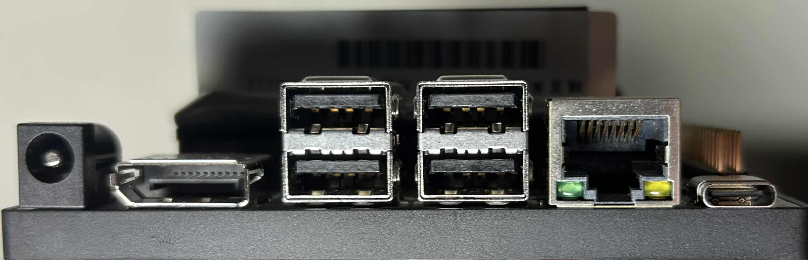

然後我們翻轉到背面

可以看到風扇的底板下面有 12 支針腳


放大來看

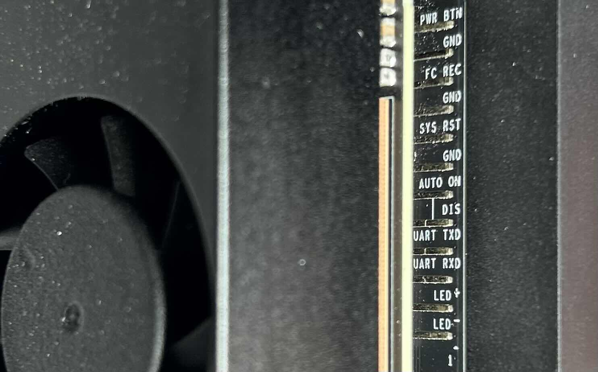

我們需要利用跳線帽 (jumper)

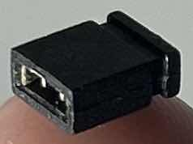

把 Pin9, Pin10 (FC REC, GND) 連接起來 (右邊留兩支針腳)

這樣才可以進入 Recovery 模式


接著把一條 USB Type-C 接上 USB Type-C 連接埠跟 Linux 主機

把鍵盤、滑鼠接到 USB Type-A 連接埠

把 Dp 顯示線從板子接到螢幕上

把網路線接上

最後把電源接上


回到 Linux 主機上

我們要安裝 SDK Manager 在 Ubuntu 裡面

前往 NVIDIA 官方下載：

- https://developer.nvidia.com/sdk-manager

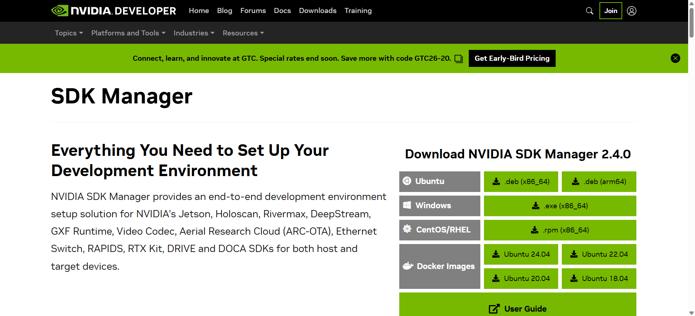

點擊 .deb (x86_64) 下載 (需先登入)


下載好 .deb 檔：sdkmanager_1.9.3-\*.deb (版本可能更新) 在 download 資料夾裡面找到它

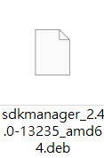

接著按下 ctrl + alt + t 打開終端 (或者桌面右鍵打開)

在終端輸入下面指令更新 Ubuntu 系統

```bash
sudo apt update
```

```bash
sudo apt upgrade -y
```

```bash
sudo apt install -y git curl wget build-essential
```

然後透過終端安裝 SDK manager

我們先透過 cd 指令

~ 代表你的使用者家目錄(Home)

所以 ~/Downloads 就是 你的下載資料夾路徑

cd 指令 (change directory) 用於變更目前終端機的 工作目錄(current working directory)

使後續指令能對該目錄及其內容進行操作

```bash
cd ~/Downloads
```

進入到下載資料夾後在終端輸入以下指令

```bash
sudo apt install ./sdkmanager_*.deb
```

安裝 SDK manager 後要啟動 GUI

```bash
sdkmanager
```

應該會出現下面的視窗畫面

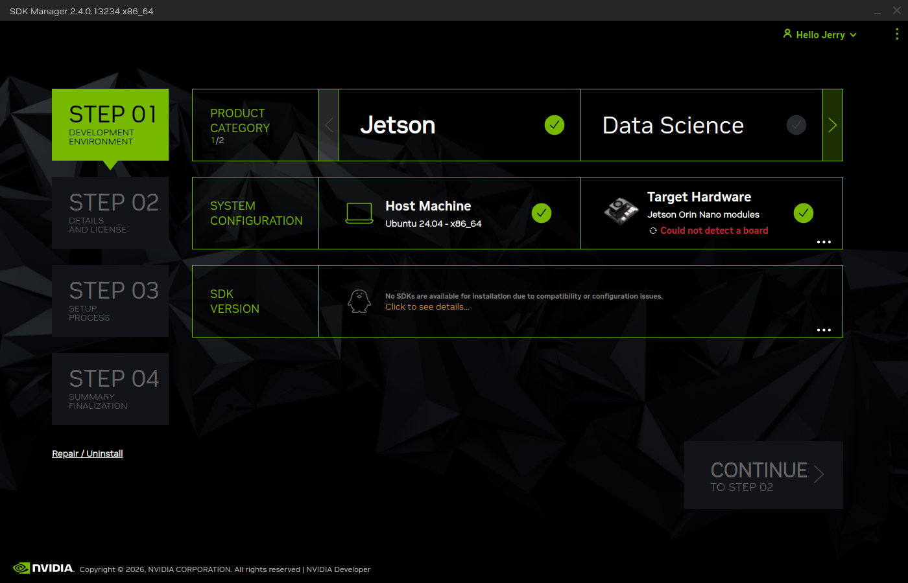

如果 type-c 接上了主機卻沒有偵測到可以重啟一下板子


確認主機偵測到板子就可以操作 SDK manager GUI 了


把 Host machine 選項關掉、安裝最新的 SDK Version、
順便把下面兩個選擇安裝的也一起裝好

確定選項選對

下面的 CONTINUE 亮起就可以點擊

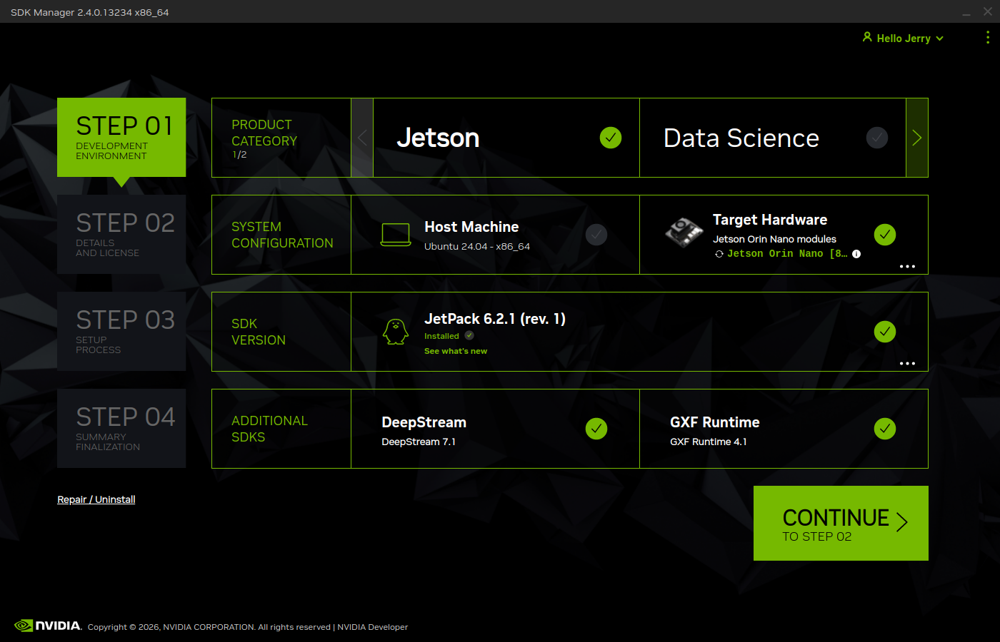

接著會到第二步

第一次安裝會先下載和創建 OS 再安裝到板子上

建議所有 目標部件 (TARGET COMPONENTS) 都安裝

把所有選項都勾好再把下面左手邊的 同意規則跟協議 (I accept the terms and conditions of the license agreements) 勾好就可以進行下一步

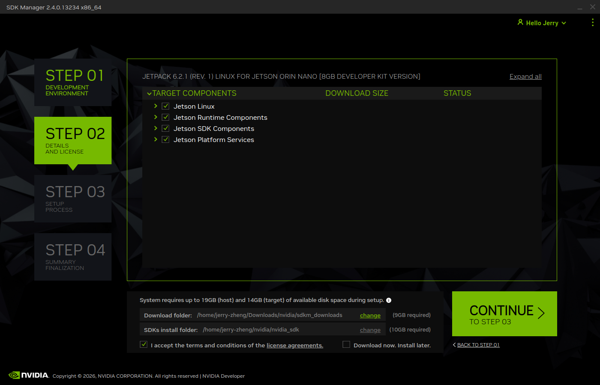

第三步就是 SDK manager 開始透過 Linux 主機幫板子安裝 OS

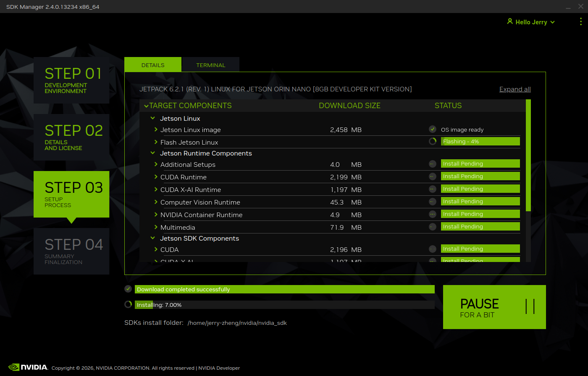

你應該會看到在板子所外接的螢幕上開始出現一些畫面

正常情況下應該是要求你幫板子設定使用者( 請牢記使用者帳號密碼 )

幫板子設定好後

接著我們回到 Linux 主機的螢幕上

Linux 主機上應該會出現下圖畫面

第一格請選 Ethernet

IP 不用填

然後把剛剛在板子設定好的使用者跟密碼輸入進去

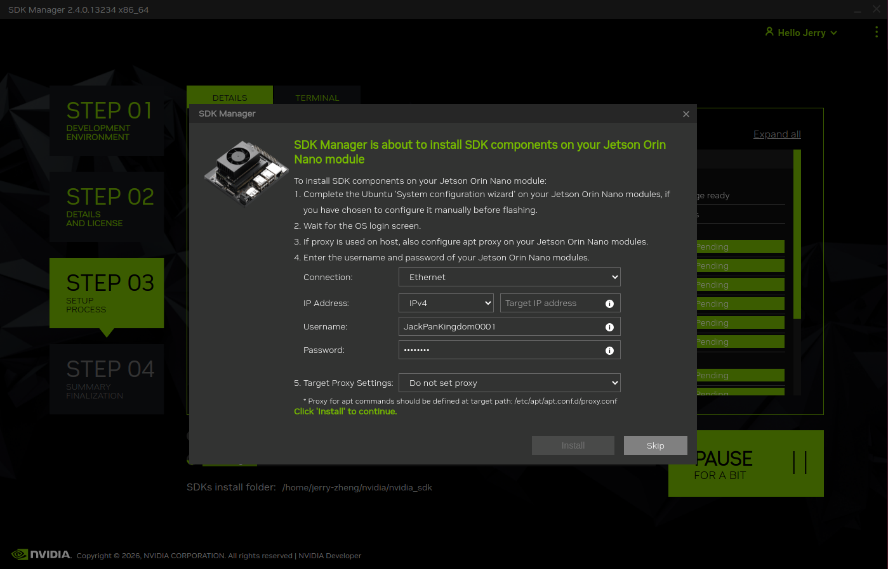

輸入好按下 Install 就可以等待主機幫我們安裝完成

安裝完會到第四步驟

第四步驟是總結

直接按 FINISH 就可以了

回到板子的螢幕上

在桌面右上角找到模式選擇欄 (預設應該是 15W )


點開之後選擇 MAXN SUPER

系統會幫忙 Reboot

等待系統完成回到桌面

原本 15W 的地方會變成 MAXN SUPER

我們就完成升級了

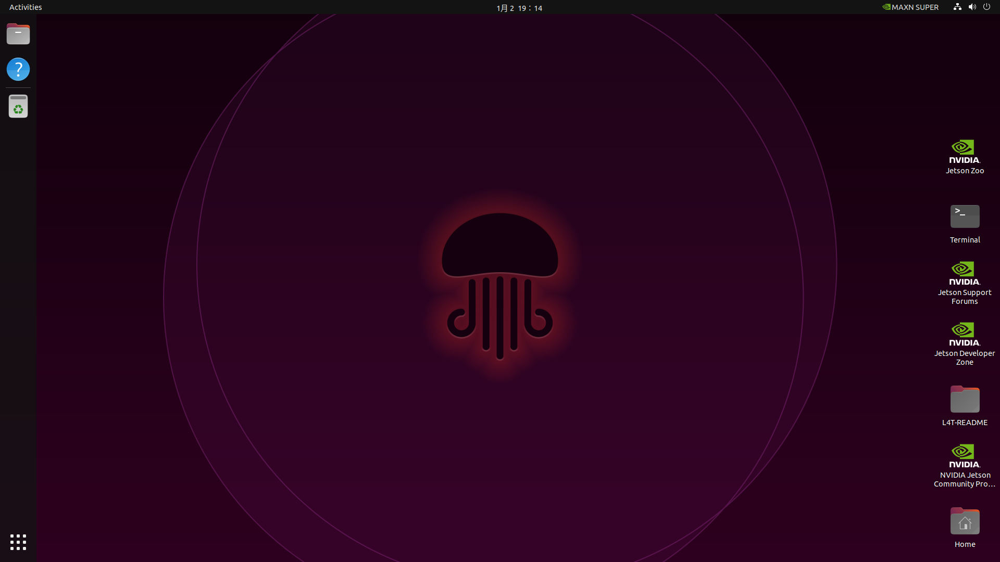

## 使用 ssh 並傳輸資料

要讓其他機器連上板子我們需要先知道板子的 ip

打開板子的終端機輸入

```bash
ip a
```

在圖中標為黃色方框的地方找到 ip

也就是 inet 192... 那一串

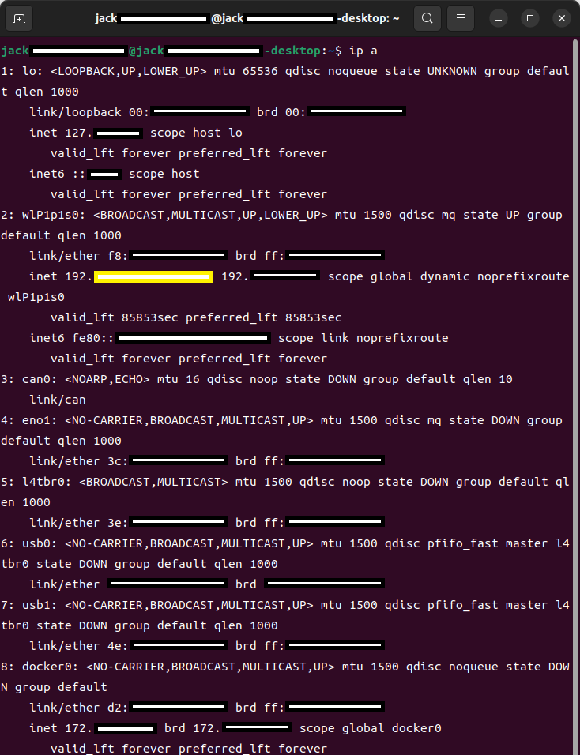

或者用更好找的方式

```bash
ifconfig
```

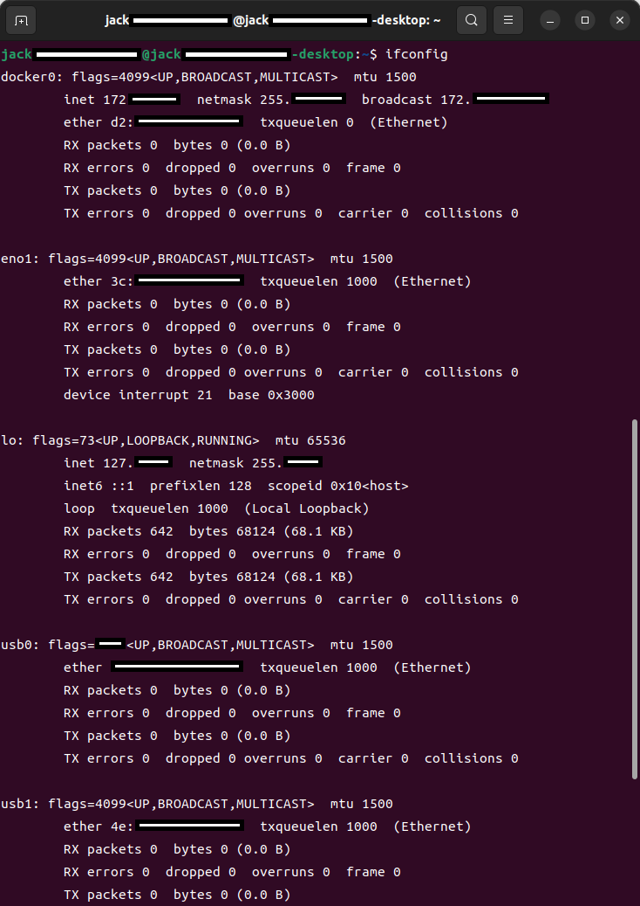

找到 wlan0 或者 wlP1p1s0

前者為連接網路線後者為使用無線網路介面卡

一樣是黃色方框

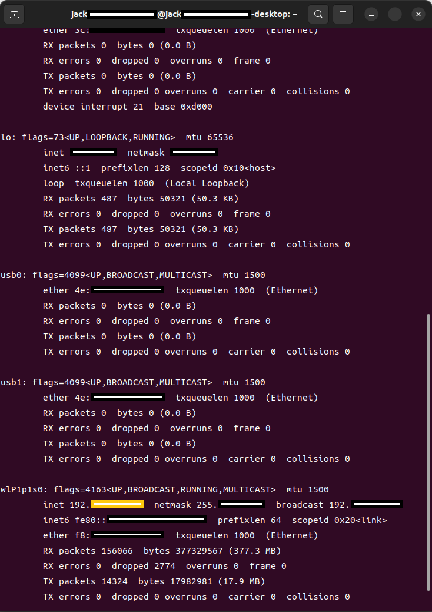

找到板子的 ip 後我們要使用 ssh 建立連線

檢查是否安裝 ssh 跟其版本

```bash
ssh -V
```

如果尚未安裝

```bash
sudo apt update
```

```bash
sudo apt install openssh-client
```

在 windows 或者其他系統打開 終端機

基本使用格式

: ssh 使用者名稱@目標 IP 位址

例如

: ssh jetson@192...

輸入連線指令後會要求你輸入被連線端的密碼

如果輸入錯誤密碼會像下圖中第一次的回覆一樣

: Permission denied, please try again.

成功登入終端機提示字元會變為遠端主機名稱

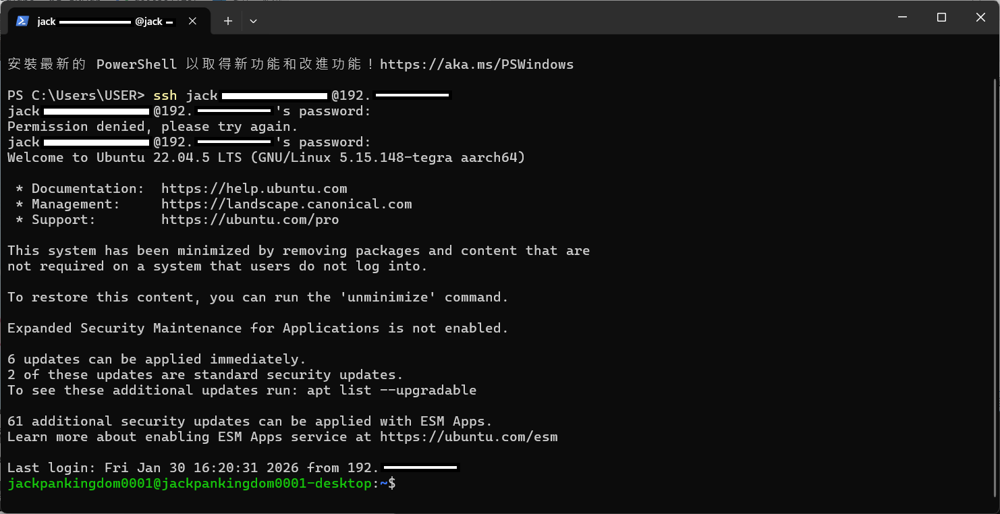

成功連接之後就是要進行資料的傳輸了

市面上有很多有 gui 的資料傳輸軟體

這邊先以 scp 的方式進行示範

scp（Secure Copy）為基於 SSH 協定之檔案傳輸工具

可在兩台裝置之間安全地複製檔案

當系統已安裝並可使用 SSH 時

通常即可直接使用 scp 進行檔案傳輸

無需額外設定

基本使用格式

順向

: scp 本機檔案 使用者@遠端 IP:目標路徑

逆向

: scp 使用者@遠端 IP:遠端檔案 本機路徑

例如: scp -r jack@192...:/home/jack/Pictures/Screenshots .

這邊的 -r 是遞迴複製 (recursive)

用途是複製「整個資料夾」

傳輸時會幫你列出各項數據

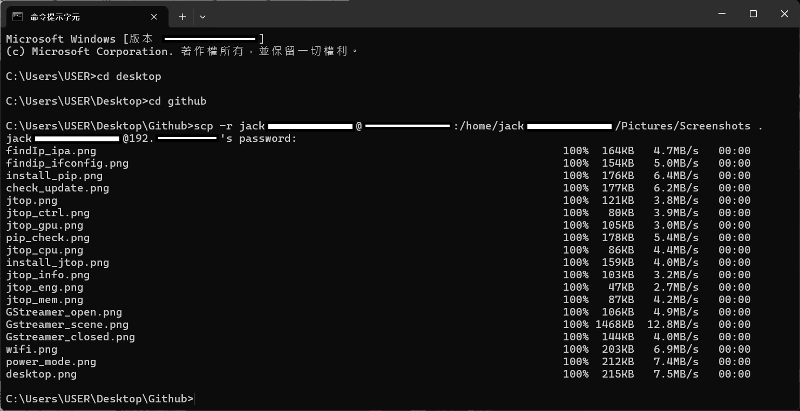

如果終端機上面的都跑到 100%

在目標端可以看到被傳輸的檔案就說明傳輸完成了

## 安裝並使用 jtop

Jetson Stats (jtop) 是用於即時監控 Jetson 裝置系統狀態的工具

可查看 CPU、GPU、記憶體、溫度、功耗與電源模式

並協助使用者掌握系統負載與效能狀況

在安裝之前先檢查系統更新

```bash
sudo apt update
```


檢查完我們要先安裝 python 中的 pip 套件才能透過它安裝 jtop

```bash
sudo apt install -y python3-pip
```


記得在每次安裝過東西後都要確認是否安裝好跟其版本

先檢查板子上所安裝的 Python

```bash
python3 --version
```

接著透過 pip 檢查自身的版本

```bash
pip3 --version
```


如果都有看到兩者的版本

那我們就可以安裝 jtop 了

```bash
sudo pip3 install jetson-stats
```

執行完安裝指令後可以試試看打不打的開

```bash
jtop
```

如果跟圖中一樣 I can't access jtop.service.

請 reboot 一次板子

reboot 指令用於重新啟動系統

使作業系統重新載入並套用最新設定或更新

```bash
reboot
```


等待板子一段時間後重啟

打開終端機叫出 jtop

```bash
jtop
```

輸入後終端會切換成 jtop gui 畫面

剛打開 jtop 的頁面是 ALL 頁面

提供 Jetson 系統的即時總覽資訊

包含 CPU、GPU、記憶體、溫度、功耗、風扇與執行中行程

適合用於效能監控與系統狀態檢查


GPU 頁面顯示 GPU 使用率、時脈與記憶體占用情況

用於確認 GPU 是否正常運作及是否被應用程式使用


CPU 頁面顯示各 CPU 核心的使用率與時脈狀態

用於觀察系統負載分布與是否發生效能瓶頸


mem 頁面顯示系統記憶體與交換空間 (Swap) 的使用狀況

用於檢查記憶體是否充足


eng 頁面顯示各硬體加速引擎 (如編碼、解碼與影像處理) 的使用狀態

用於確認硬體加速是否啟用


ctrl 頁面提供電源模式、時脈與風扇等系統控制選項

用於調整效能與功耗設定


info 頁面顯示 Jetson 裝置與系統的基本資訊與版本資訊

用於確認硬體與軟體環境


使用完畢就點擊 Quit 就會關閉 jtop

## 安裝並測試 Webcam

拿出事先準備好的網路攝影機

示範攝影機的型號是 Usb-a 的 Logitech C270 HD Webcam

把 Usb 接上板子

在板子上找到應用程式區域

打開一個叫 Cheese 的程式

如果可以打開並且看到影像就說明攝影機可以使用

但是本次測試時是無法使用 Cheese 的

所以我們改以 GStreamer 的方式測試攝影機

第一步先確認板子有沒有偵測到 USB 攝影機

```bash
lsusb
```

正常情況你會看到類似：

Bus 001 Device 008: ID 046d:0825 Logitech, Inc. Webcam C270

第二步確認 Linux 有建立攝影機裝置節點

```bash
ls /dev/video*
```

正常情況你會看到類似：

/dev/video0 /dev/video1

第三步就是打開 GStreamer 了

```bash
gst-launch-1.0 v4l2src device=/dev/video0 ! videoconvert ! autovideosink
```


輸入打開 GStreamer 的指令後會跳出一個新視窗

裡面的畫面就是從攝影機輸入的


測試完關閉彈出視窗就可以了


## 使用 OpenCV 處理影像

OpenCV（Open Source Computer Vision Library）是一套廣泛使用的電腦視覺與影像處理函式庫

提供完整的影像讀寫、像素運算、顏色空間轉換、幾何變換、影像濾波、特徵偵測與視訊串流等功能

由於其 API 完整、社群資源豐富且跨平台支援良好

OpenCV 常被用於快速建立影像處理原型與即時視覺應用

本章節以 OpenCV 實作基礎影像處理流程

包含灰階轉換、色彩抽取、抽色與灰階融合

以及在影像上疊加文字資訊

作為後續進階電腦視覺任務（例如物件偵測、追蹤與相機串流處理）的基礎

打開終端機

透過指令打開 jtop

```bash
jtop
```

從下面的導覽行跳到 info 頁面

在 info 頁面裡面找到 OpenCV 的版本

如果有看到就是 SDK manager 幫你安裝成功了


接下來在寫程式之前我們要打開文字編輯器

這邊我選擇安裝 VScode 以便更舒適的開發

如果不想安裝也可以

打開控制台

使用 cd 指令將目標資料夾改成 download 資料夾

```bash
cd ~/Downloads
```

接下來用指令下載 arm64 版本的 VScode

ARM64 版本的程式是為 ARM 架構的 64 位元處理器編譯

與一般 x86 版本不同

兩者指令集不相容

必須依對應硬體架構使用對應版本

ARM64 架構是一種 64 位元的 ARM 處理器指令架構

具有低功耗與高效能特性

廣泛應用於嵌入式裝置、行動裝置與邊緣運算平台

wget 是一種用於從網路下載檔案的指令工具

可透過 HTTP、HTTPS 或 FTP 協定將遠端資源下載至本機

```bash
wget -O vscode_arm64.deb "https://code.visualstudio.com/sha/download?build=stable&os=linux-deb-arm64"
```


使用 wget 指令後就會看到下方有進度條正在跑


在下載一段時間後終端會詢問你是否要加入 MS repo 跟 signing key 以便之後透過 apt 更新 VScode

用方向鍵選到 YES 按下 Enter 就可以了


等到進度條到達 100%

打開 download 資料夾查看有沒有一個 vscode_arm64.deb 的檔案


檢查完是否有下載成功就可以安裝了

```bash
sudo apt install ./vscode_arm64.deb
```

下載後我們點開桌面左下角的 show application


進入 app 中心後往後面的頁面找

應該會找到 VScode 就代表安裝完成了


接下來需要安裝注音輸入法

如果使用英文打註解也可以不用安裝

首先先到右上角有關機、網路圖式的地方點一下

跳出一個導覽頁後點擊 setting


在設定頁面左邊的導覽區域往下移動

找到 Region & Language 並點擊


在跳出的視窗點選 Manage Installed Languages

點擊後系統會檢查 Language Support 是否可以使用


如果是第一次開啟可能會安裝未完全跳出類似下圖的視窗

點擊 Install 讓系統幫忙補全 Language Support


補全 Language Support 後會打開 Language Support 的視窗

檢查一下 Language 的區域有沒有 Chinese(Taiwan)


接著回到 setting 的導覽行

找到 鍵盤 (Keyboard) 的設定頁面


在輸入來源的地方找到 + 並且點擊


再點擊三個點的地方


點擊其他


在 C 的區域找到 Chinese (新酷音) 點擊右上角的加入


加入完回到鍵盤設定的輸入來源檢查有沒有 Chinese (新酷音)


確認有加入到就可以使用注音輸入法了

如果需要倉頡或其他的輸入法就到同樣的地方找到想要的輸入來源就可以了

快捷切換 Chinese (新酷音) 跟 English 可以使用 Windows + Space 鍵

但是在 Chinese (新酷音) 下也可以用 Shift 快速切換中英

做好了這些工作就可以開始寫我們的第一個程式碼了

要操作 OpenCV 之前我們需要先測試一下鏡頭

```bash
ls /dev/video*
```


看到 video0 video1 就回到 VScode

本範例示範如何使用 OpenCV 透過攝影機擷取單張影像

並將影像儲存為圖片檔案

作為後續影像處理與分析的基礎


本範例示範如何使用 OpenCV 將彩色影像轉換為灰階影像

灰階影像僅保留亮度資訊

不包含色彩資訊

常用於影像分析、邊緣偵測與二值化等前處理步驟


本範例示範如何將影像轉換為 HSV 色彩空間

並透過設定色彩範圍擷取特定顏色區域

此技術常用於物件偵測、目標追蹤與顏色分割應用


本範例示範如何將已抽取特定顏色的影像與原始灰階影像進行融合

使目標顏色保留彩色

其餘區域呈現灰階效果

此技術常用於視覺強調（Highlighting）與目標標示應用


本範例在完成「藍色抽取與灰階融合」後

使用 OpenCV 的 putText() 函式

在影像上標示文字 “Blue”

用於說明畫面中被強調的顏色區域


