# Nvidia Jetson Orin Nano

# 升級 SUPER mode

## 致謝

本手冊之完成與相關研究設備之建置，特別感謝蘇建華董事長慷慨支持，提供本系資訊數學組使用 NVIDIA Jetson Orin Nano 開發板，協助本系推動人工智慧、邊緣運算與數學應用相關之教學與研究工作。

董事長對於高等教育與科技人才培育之重視，不僅提升本系學生之實作能力，也為跨領域學習與研究奠定良好基礎。在此謹致以最誠摯之感謝與敬意。

## 目錄

- [頁首](#nvidia-jetson-orin-nano)
- [致謝](#致謝)
- [第一章-系統主機安裝準備](#linux-系統主機安裝準備)
- [第二章-安裝linux-系統](#安裝-Linux-系統)
- [第三章-升級-Jetson-Orin-Nano](#升級-Jetson-Orin-Nano)

## Linux 系統主機安裝準備

如果沒有 Linux 主機，可以選擇 Windows + Linux 雙系統，先預留切割硬碟空間 80〜120GB 給 Linux 系統 ，再使用 Usb 隨身碟進行安裝，或是硬碟在初期就已經切割過可以使用已經切好的空間。

在切割硬碟空間前確認以下條件

- 足夠的硬碟空間(至少預留 40〜60GB 給 Linux 系統)
- BIOS 模式為 UEFI
- 支援安全開機 (Secure Boot)
- 關閉 BitLocker
- 關閉 快速啟動
- 不要壓縮系統磁碟

切割硬碟空間

下載 MiniTool Partition Wizard（免費版即可）

- https://www.partitionwizard.com/free-partition-manager.html

開啟 MiniTool Partition Wizard


打開後找到 D 槽


右鍵點 D 槽 → Move/Resize (移動/調整)


把 D 槽的「右側邊界」往左拖 180GB 的距離

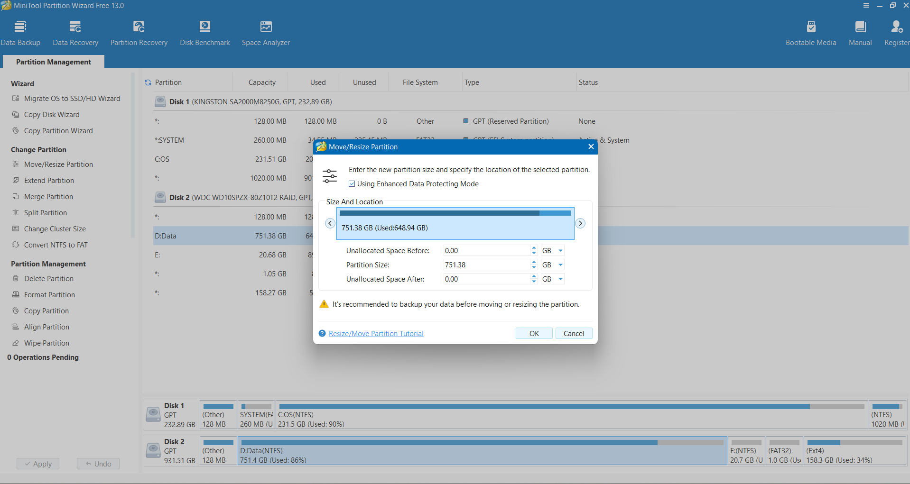


按 Ok 讓系統執行磁碟移動

- 進入一個藍色背景的介面，執行磁碟移動（可能 5〜30 分鐘）

等待系統要求重新啟動

完成後你會看到剛剛選擇的槽位被分割了

## 安裝 Linux 系統

接下來製作 Ubuntu 開機 USB

我們會需要

- 至少 8GB 的 USB 隨身碟、網路

準備好隨身碟，點開下面的網址

- https://releases.ubuntu.com/22.04

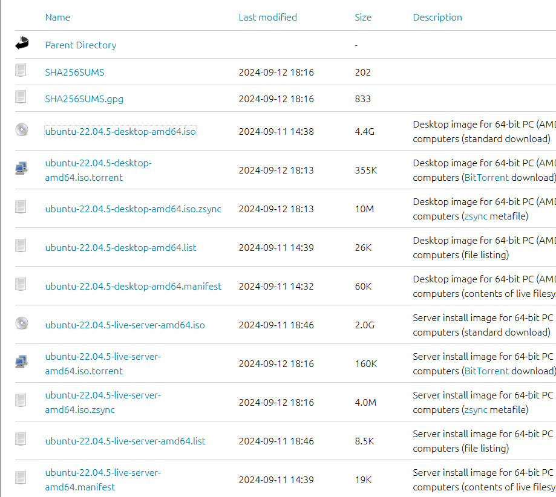

選擇 ubuntu-22.04.5-desktop-amd64.iso 進行下載

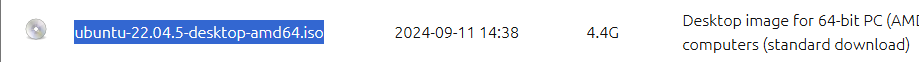

下載後在存放的地方可以找到剛剛所下載的 ubuntu-22.04.5-desktop-amd64.iso (應該是CD icon )

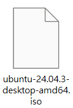

然後我們要下載 Rufus (製作 USB 工具的程式)

- https://rufus.ie/zh_TW

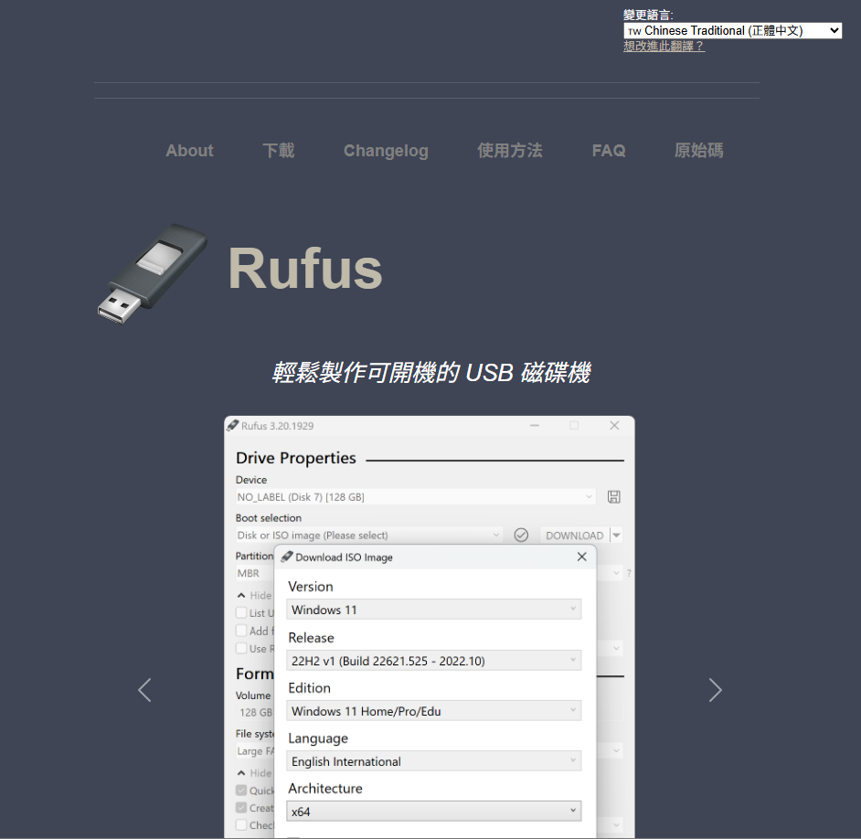

在網頁下面找到下載的區域

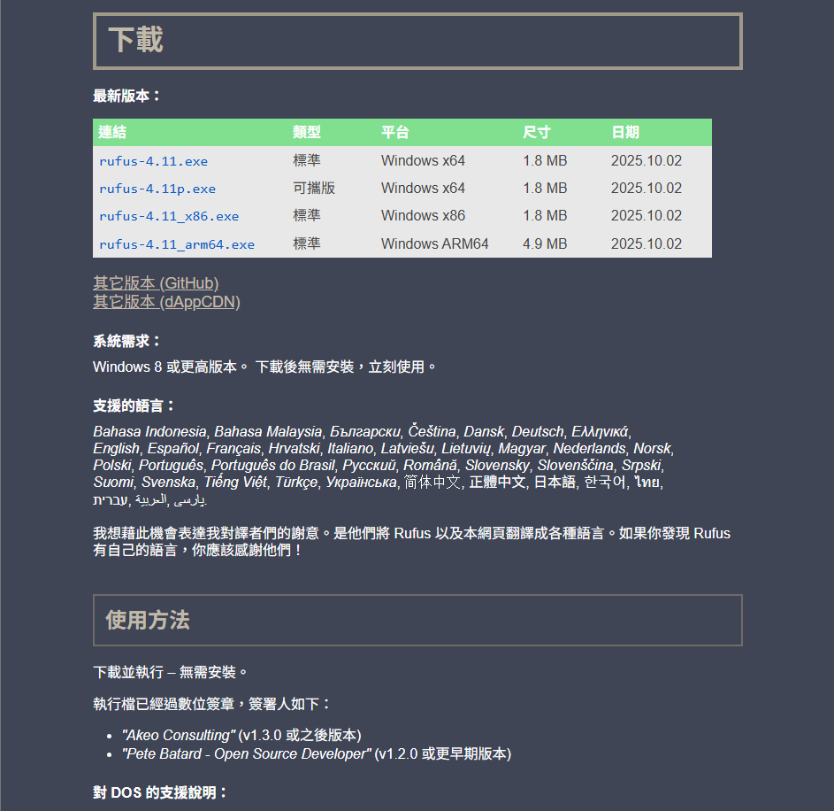

找到適合自己系統的版本並且下載 (示範版本為 Windows x86)

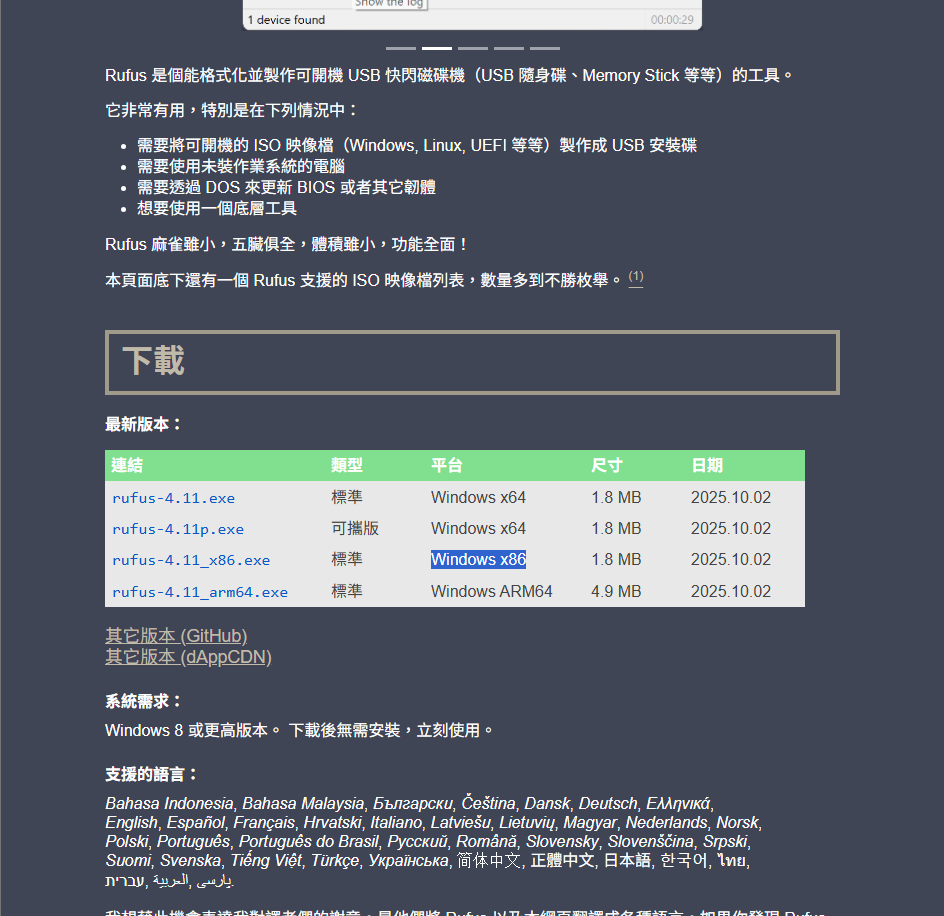

打開下載好的程式

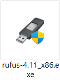

裡面的畫面應該如下圖

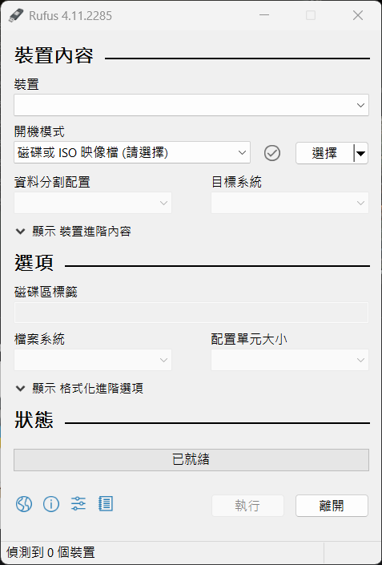

插入剛剛所準備的 USB ，會看到裝置的欄位會偵測到所插入的 USB

會看到 (裝置) 的地方顯示 USB 的名稱

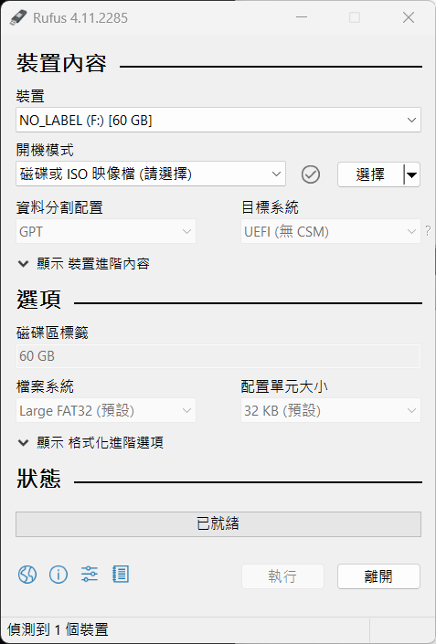

找到 (開機模式) 那一行右手邊的選擇按鈕

找到剛剛你所下載的 iso 檔案並且打開

打開成功會看到剛剛下載的 Ubuntu 版本跟藍色勾勾

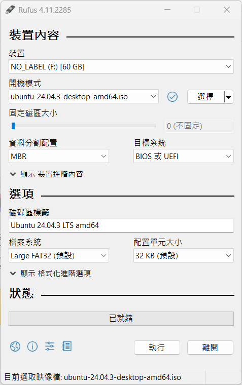

接下來確認資料分割是 GPT

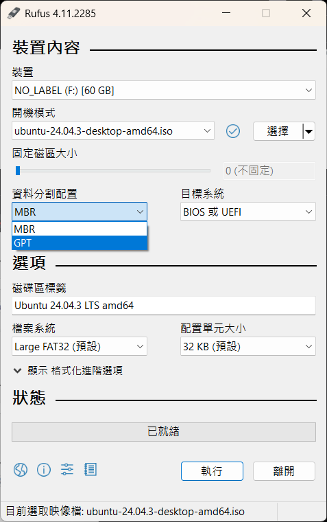

目標系統會自動選擇 UEFI

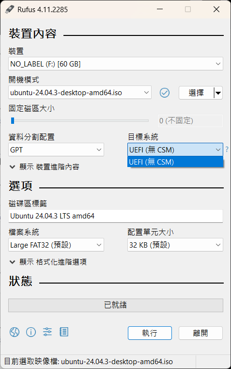

檢查檔案系統是否為 Large FAT32

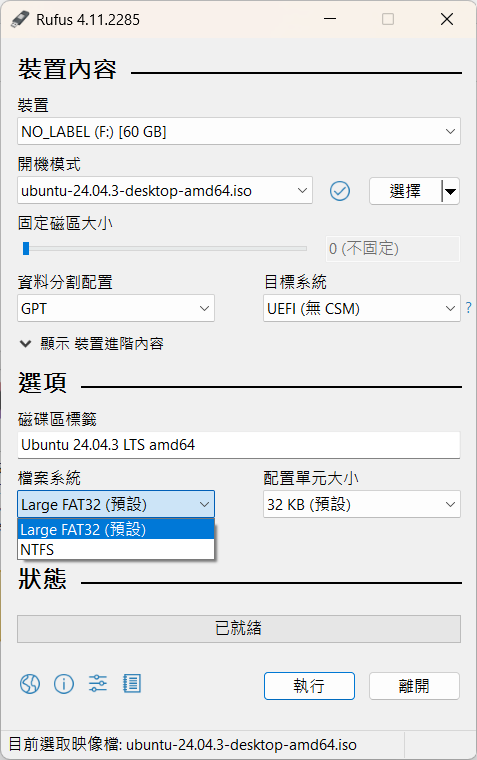

確定 Rufus 程式內的裝置內容和下圖一致就可以按下 (執行) 讓程式製作 USB 開機工具

接著會跳出下圖的畫面

選擇以 ISO 映像模式寫入

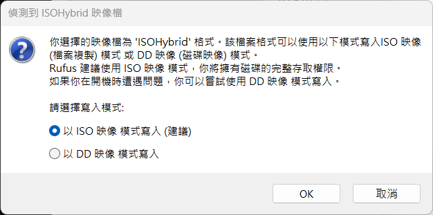

按下 OK 後程式會提醒你

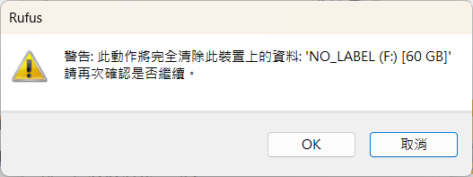

再次按下 OK 後程式就會開始運作

等到程式運作完成

保持 USB 插著接著重新啟動電腦

當 Windows 正在重啟時，開始按 開機選單 的按鍵

不同品牌按鍵不同，但最常見是：Esc/F12/F11/F8/F9

當你看到開機選單，在 Boot Menu 選擇 USB 裝置

名稱可能類似：

- UEFI: Sandisk USB
- UEFI: Kingston DataTraveler
- UEFI: USB Disk

選擇完裝置，讓程式跑一段時間你會看到 Ubuntu 的紫色/黑色畫面，跟兩個選項

- Try Ubuntu without installing (試用)
- Install Ubuntu (安裝)

請選：Install Ubuntu

選擇完上述選擇，跟著 Ubuntu 設定啟動所需的項目

- 語言選擇
- 鍵盤
- 分割區設定 (拉到最大)

安裝好可以進入桌面就到右上角的開機符號選擇重新開機

在重新開機的時候應該可以看到 GRUB 選單

- Ubuntu
- Windows Boot Manager

就代表成功建立雙系統

## 升級 Jetson Orin Nano

升級前準備

- Jetson Orin Nano Developer kit \* 1
- 跳線帽 (Jumper Cap)
- 網路線 \* 1
- Usb (Usb-A) to Type-c (Usb-C) 數據線 \* 1
- 滑鼠 (建議無線) \* 1
- 鍵盤 (建議無線) \* 1
- 螢幕 (Dp 孔，HDMI 須轉接) \* 1
- Linux 系統主機 \* 1

首先我們看到Jetson Orin Nano Developer kit


打開這個箱子


把內容物取出，應該會有一個板子、一個電源供應器、兩條規格不同的電源線(臺規、歐規)、跟一本說明書


留下一條適合的電源線、板子跟、電源供應器

接著看到板子上很多連接埠的這一面

由左至右分別是

- DC 電源輸入孔
- DP 顯示輸出埠
- USB Type-A 連接埠 \* 4
- RJ-45 網路連接埠
- USB Type-C 連接埠


然後我們翻轉到背面

可以看到風扇的底板下面有12支針腳


放大來看


我們需要利用跳線帽 (jumper)


把 Pin9, Pin10 (FC REC, GND) 連接起來 (右邊留兩支針腳)

這樣才可以進入 Recovery 模式


接著把一條 USB Type-C 接上 USB Type-C 連接埠跟 Linux 主機

把鍵盤、滑鼠接到 USB Type-A 連接埠

把 Dp 顯示線從板子接到螢幕上

把網路線接上

最後把電源接上


回到 Linux 主機上

我們要安裝 SDK Manager 在 Ubuntu 裡面

前往 NVIDIA 官方下載：

- https://developer.nvidia.com/sdk-manager


點擊 .deb (x86_64) 下載 (需先登入)


下載好 .deb 檔：sdkmanager_1.9.3-\*.deb (版本可能更新) 在 download 資料夾裡面找到它


接著按下 ctrl + alt + t 打開終端 (或者桌面右鍵打開)

在終端輸入下面指令更新 Ubuntu 系統

```bash
sudo apt update
```

```bash
sudo apt upgrade -y
```

```bash
sudo apt install -y git curl wget build-essential
```

然後透過終端安裝SDK manager

我們先透過 cd 指令

~ 代表你的使用者家目錄(Home)

所以 ~/Downloads 就是 你的下載資料夾路徑

cd 指令 (change directory) 用於變更目前終端機的 工作目錄(current working directory)

使後續指令能對該目錄及其內容進行操作

```bash
cd ~/Downloads
```

進入到下載資料夾後在終端輸入以下指令

```bash
sudo apt install ./sdkmanager_*.deb
```

安裝 SDK manager 後要啟動 GUI

```bash
sdkmanager
```

應該會出現下面的視窗畫面


如果 type-c 接上了主機卻沒有偵測到可以重啟一下板子


確認主機偵測到板子就可以操作 SDK manager GUI 了


把 Host machine 選項關掉、安裝最新的 SDK Version、
順便把下面兩個選擇安裝的也一起裝好

確定選項選對

下面的 CONTINUE 亮起就可以點擊


接著會到第二步

第一次安裝會先下載和創建 OS 再安裝到板子上

建議所有 目標部件 (TARGET COMPONENTS) 都安裝

把所有選項都勾好再把下面左手邊的 同意規則跟協議 (I accept the terms and conditions of the license agreements) 勾好就可以進行下一步


第三步就是 SDK manager 開始透過 Linux 主機幫板子安裝 OS


你應該會看到在板子所外接的螢幕上開始出現一些畫面

正常情況下應該是要求你幫板子設定使用者( 請牢記使用者帳號密碼 )

幫板子設定好後

接著我們回到 Linux 主機的螢幕上

Linux 主機上應該會出現下圖畫面

第一格請選 Ethernet

IP 不用填

然後把剛剛在板子設定好的使用者跟密碼輸入進去


輸入好按下 Install 就可以等待主機幫我們安裝完成

安裝完會到第四步驟

第四步驟是總結

直接按 FINISH 就可以了

回到板子的螢幕上

在桌面右上角找到模式選擇欄 (預設應該是15W )


點開之後選擇 MAXN SUPER

系統會幫忙 Reboot

等待系統完成回到桌面

原本 15W 的地方會變成 MAXN SUPER

我們就完成升級了


