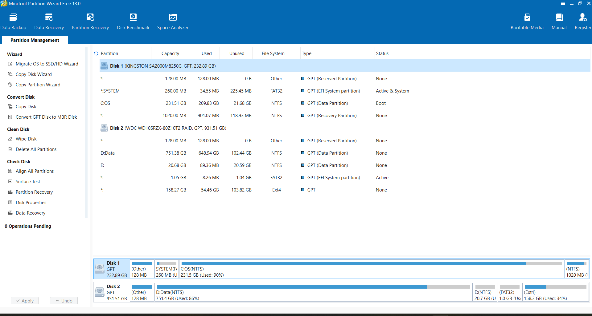
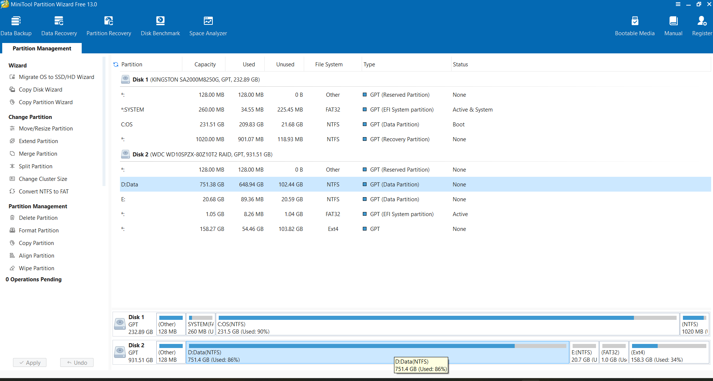
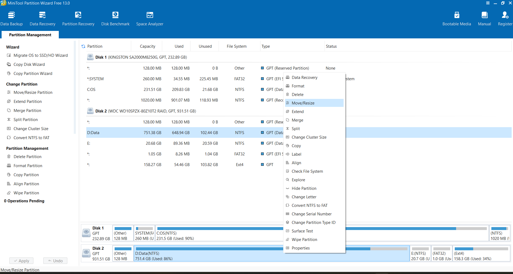
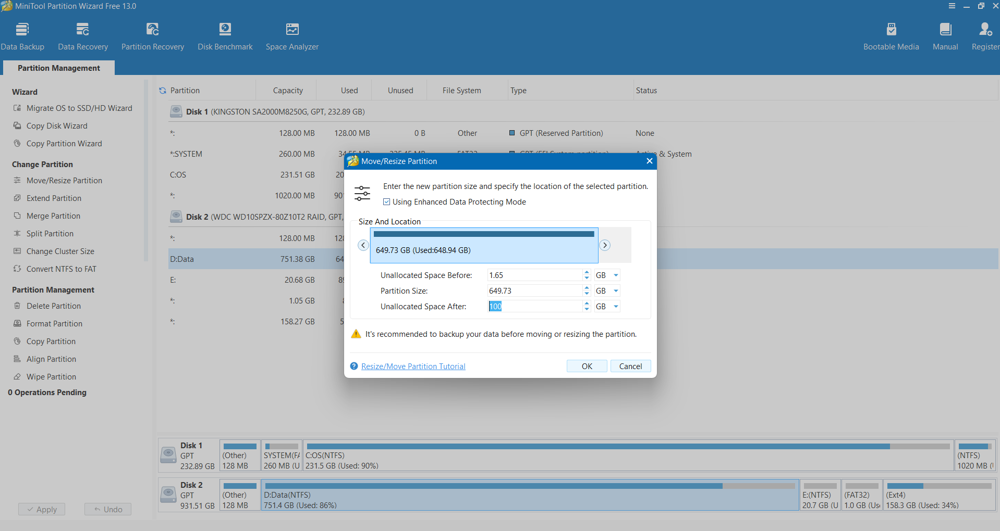

# Nvidia Jetson Orin Nano
# 升級 SUPER mode

## 致謝

### 本手冊之完成與相關研究設備之建置，特別感謝蘇建華董事長慷慨支持，提供本系資訊數學組使用 NVIDIA Jetson Orin Nano 開發板，協助本系推動人工智慧、邊緣運算與數學應用相關之教學與研究工作。

### 董事長對於高等教育與科技人才培育之重視，不僅提升本系學生之實作能力，也為跨領域學習與研究奠定良好基礎。在此謹致以最誠摯之感謝與敬意。

## 升級前準備

- 網路線 * 1
- Usb (Usb-A) to Type-c (Usb-C) 數據線 * 1
- 滑鼠 (建議無線) * 1
- 鍵盤 (建議無線) * 1
- 螢幕 (Dp 孔，HDMI 須轉接) * 1
- Linux 系統主機 * 1

## Linux 系統主機

### 如果沒有 Linux 主機，可以選擇 Windows + Linux 雙系統，先預留切割硬碟空間 80〜120GB 給 Ubuntu ，再使用 Usb 隨身碟進行安裝，或是硬碟在初期就已經切割過可以使用已經切好的空間。

### 在切割硬碟空間前確認以下條件

- 足夠的硬碟空間(至少預留 40〜60GB 給 Ubuntu)
- BIOS 模式為 UEFI
- 支援安全開機 (Secure Boot)
- 關閉 BitLocker
- 關閉 快速啟動
- 不要壓縮系統磁碟
- 所需工具: 至少 8GB 的 USB 隨身碟、網路

### 切割硬碟空間

### 下載 MiniTool Partition Wizard（免費版即可）

- https://www.partitionwizard.com/free-partition-manager.html

### 開啟 MiniTool Partition Wizard

### 打開後找到 D 槽

### 右鍵點 D 槽 → Move/Resize (移動/調整)

### 把 D 槽的「右側邊界」往左拖 180GB 的距離

### 按 Ok 讓系統執行磁碟移動

- 進入一個藍色背景的介面，執行磁碟移動（可能 5〜30 分鐘）

### 等待系統要求重新啟動

### 完成後你一定會看到剛剛選擇的槽位被分割了