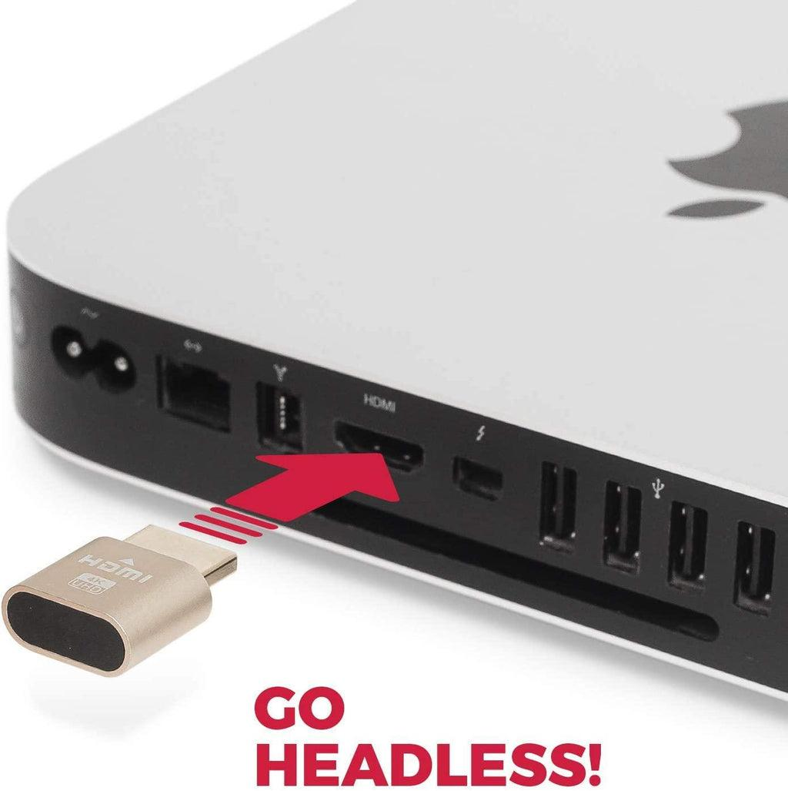

# Jetson Orin Nano入門與即時影像處理

## 本週將帶領學生完成 Jetson Orin Nano的基礎環境建置，並透過遠端桌面工具進行操作

學生將學會
- 如何將檔案傳輸至 Jetson，並建立遠端操作環境。

- 在完成基本連線後，課程將導入即時影像處理，利用攝影機取得畫面，並透過程式進行簡單的影像轉換，例如灰階處理、色彩轉換與影像融合

透過即時回饋，學生將初步理解影像資料的處理流程，為後續的人工智慧視覺應用奠定基礎。

## 遠端操作跟設備準備

在一些特定環境下（像是常常要改變環境）我們沒辦法使用外接螢幕但是又需要看到 Jetson Orin Nano（以下稱為板子）桌面發生的事情

就需要遠端連線程式

讓我們要連線的兩個裝置（一台操作電腦跟一台 Jetson）都處於同個內網或者使用VPN連線

在兩邊裝上同樣的程式就可以順利的連線

這邊我們選擇使用開源的 Nomachine當我們的橋樑

https://www.nomachine.com

進入以上連結後請下載裝好 Windows版本再點擊 Other operation systems下載給板子的版本

到給其他作業系統的版本後到頁面最下面會有一個 Nomachine Embedded Editions

選擇 ARM之後下載裡面 ARM 64-bit區域的 arrch64版本

下載之後我們要怎麼傳輸這個檔案呢

在內網或者是有 VPN的情況下我們可以使用 SCP幫助我們進行無線的傳輸

在這之前我們先了解一下 SSH跟 SCP 是什麼

SSH（Secure Shell）用來遠端登入另一台電腦

登入後就可以
- 遠端下指令
- 管理伺服器
- 跑程式
- 開 Docker
- 控制 Jetson
- ...

SCP（Secure Copy）用 SSH 來傳送檔案

所以 SCP是建立在有 SSH的情況下才可以傳送檔案

會使用這兩個工具是很重要的能力

未來有很多事情都要在這個黑黑的終端機裡面做處理

在使用 SCP前我們需要做一下檢查

像是我們在使用 Git之前要檢查版本一樣

打開 Powershell後

```bash
ssh
```

應該會有 usage: ssh ...

確認可以使用 SSH後

接下來以以下格式輸入終端機連上你所要使用的板子

ssh username@jetson-ip

例如: ssh jerryDesktop@999.999.99.99

第一次連線通常會出現

```bash
The authenticity of host '192.168.x.x' can't be established.
ED25519 key fingerprint is SHA256:xxxxxxx
Are you sure you want to continue connecting (yes/no)?
```

這一串是 SSH fingerprint（主機指紋）

這是系統在問你「你確定這台電腦是你要連的那台嗎？」

讓你確認連線上的 IP是你認識的而不是別人冒充的

如果你確定 IP是你要連的 Jetson請輸入 yes

可以防止中間人攻擊

輸入 yes後會有一段類似 Welcome to Ubuntu XX.XXX.5 LTS (GNU/Linux 5.XX.XXX-tegra aarch64)

之後如果沒有意外這個詢問就不會再出現了

同時你會看到終端機的名字變成綠色而且跟你剛剛輸入要連線的帳號一致

現在有了 SSH當基礎

就可以用 SCP傳送資料或者資料夾了

傳送資料

例子（你 → 板子）

scp file.txt username@jetson-ip:/home/user/

例子（板子 → 你）

scp username@jetson-ip:/home/user/file.txt .

傳送資料夾

例子（你 → 板子）

scp -r Folder_name username@jetson-ip:/home/user/

例子（板子 → 你）

scp -r username@jetson-ip:/home/user/ Folder_name

現在請用傳送資料的方式把剛剛下載好的 Nomachine.deb傳送到板子的桌面

現在把安裝包拿來用（依照情況修改路徑）

```bash
sudo apt install ./nomachine_*.deb
```

安裝完之後確認服務有沒有啟動

```bash
sudo /etc/NX/nxserver --status
```

正常會看到 NX> 162 Enabled service: nxserver.

如果沒開

```bash
sudo /etc/NX/nxserver --start
```

確認服務有啟動後就可以打開 Windows電腦進行連線了

打開桌面的 Nomachine

正常應該會看到有你板子的帳號

點進去後輸入密碼應該就可以連線了

連線過程中一樣會有一個確認主機指紋的

點選 yes就好

連線上後會有一個視窗跳出來

就是你的板子的桌面

但是你可能會發現桌面好像怪怪的

可能會有很多殘影或是黑黑的

那是因為我們現在沒有連接螢幕

作業系統會不知道要輸出螢幕訊號

這時候我們就需要裝上 Headless DP Dummy Plug（虛擬顯示器 / 假螢幕）



系統才會啟動圖形介面（GUI）

這樣我們才能在 Nomachine上看到輸出的畫面

回顧一下整個步驟

要連線第一步是讓被連線電腦在同一個內網或用 VPN連上

檢查 IP跟用戶名稱

```bash
hostname -I
```

```bash
whoami
```

檢查雙邊的 SSH服務

SSH連線

看到畫面後在開始製作影像處理的部分之前

我們要先安裝一個叫做 Jtop的程式

回到根目錄的 README.md中的（安裝並使用 jtop）章節